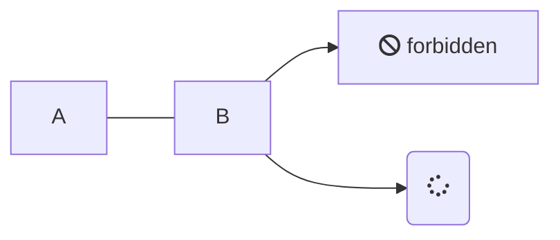

# Docs-as-Code

## What?
- Documentation
  - In your repo 
    - Sourced from code 
       - Rendered on the fly

- Docs live in your repo, in a subfolder `/docs`

```mermaid
graph LR
    A --- B
    B-->C[fa:fa-ban forbidden]
    B-->D(fa:fa-spinner);
```
