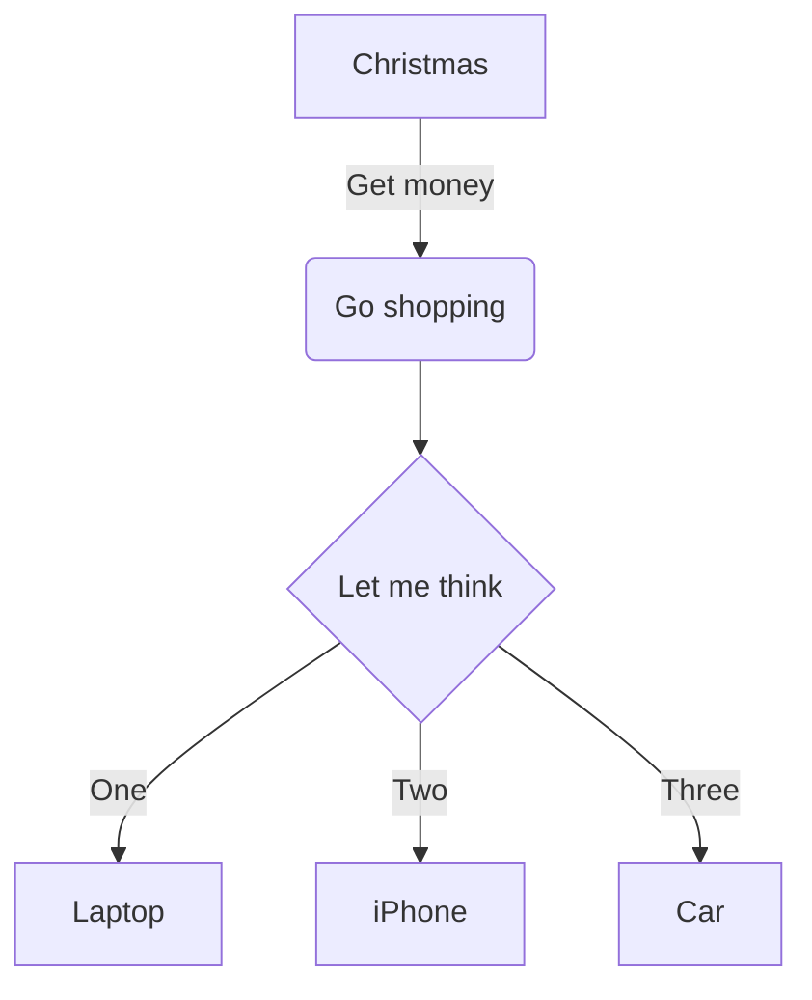
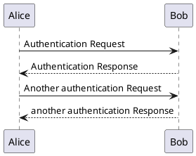

# Graphs-As-Code

There are numerous options for graphing in your docs-as-code. 
All graph libraries hi-lighted here all follow the pattern:
- Rendered client side
  - No pipeline to build / deploy 
  - Changes are instantaneous
- Graph 'source' is within the document itself and is markdown-centric / standard plaintext
  - Makes changes clear
  - Makes changes easy for end users


## Mermaid

Here is an example Mermaid flow chart:



In 'Docs-as-Code' markdown, that code looks like this:

````markdown

````

A good place to develop your Mermaid code is: https://mermaid-js.github.io/mermaid-live-editor/


## PlantUML

We can also render PlantUML diagrams client-side



In 'Docs-as-Code' markdown, that code looks like this:
````

````
